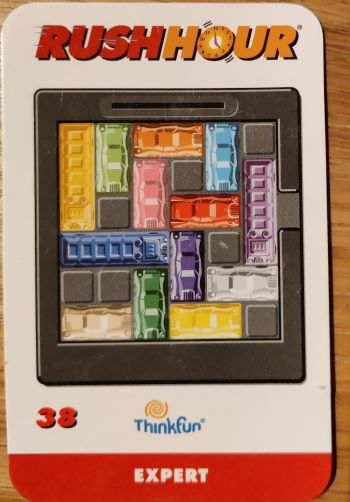
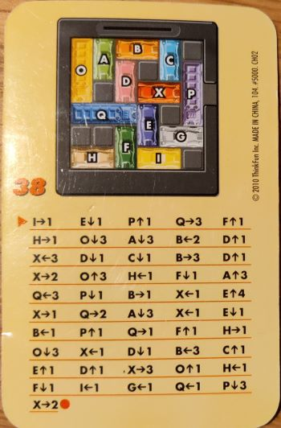

# Rush Hour

# Introduction

Rush Hour is a sliding block logic game, where the task
is to move cars for the red car to exit the board.

One of my kids got this game as a birthday present a while back. More recently, I found him trying to solve one of the "Expert" level boards, number 38 shown below.



The goal is to move the red car out the opening to the right. However, this
task is by no means trivial. Struggling with it for a long time and stumbling 
upon a solution, I could not remember what I actually did to solve it.

The backside of the game cards do show solutions, for instance this one:



In this case, the solution involves a sequence of 51 moves, where each move
moves a car either 1, 2, 3 or 4 squares. Summing the length of all the moves,
the solution moves the cars a total of 84 squares.

## The implementation

I'm aware that there are many different implementations that solve Rush Hour
boards, for instance available on github. However, I didn't really want to 
see a complete solution, I wanted to have a go at making my own. So I'm by
no means trying to say that my implementation is better than any other 
implementation out there.

After a few failed attempts, I figured that implementing something like the 
[Dijkstra Algorithm](https://en.wikipedia.org/wiki/Dijkstra%27s_algorithm) 
would be a good solution. Basically, every board position is a node in a graph, 
and its neighbours are possible moves from this position.

In this implementation, Dijkstra's Algorithm is implemented as an integrated
part of building the graph of board positions. This makes some details of the 
textbook implementation of Dijkstra's Algorithm unnecessary:
   
   * No need to keep a set of visited and unvisited nodes. Each node is visited as 
     it is found.
   * No need to initialize the path distance for each node to infinity, as the node
     will get an actual distance value set as it is found.

When writing the code, it was not obvious to me what would be the best way to 
define the "best" solution. Two options came to mind:

  1. Moving one car any number of squares counts as one move. The target is to minimize the number of moves. In the example of board 38 above, this corresponds to minimizing the number of moves, which was 51 in this specific case. In the code, this option is implemented 
  setting the parameter 
  
     ```minimize = "car_swaps" ```

  2. Moving one care one square counts as one move. Again, the target is to mimize the number
  of moves. In the example of board 38 above, this corresponds to minimizeing the total number
  of sqares moved, which was 84 in this specific case. In the code, this option is implemented
  setting the  parameter 
  
     ```minimize = "move_count" ```

I was curious whether one would prove advantageous over the other.

## Testing

Testing of the project is implemented using pytest. In order to test, simply run:

```pytest .```

## The results

Solving board #38 is implemented as part of the pytest. The resuts were:

```
Minimized the move_count
Found solution with 83 moves, swapping car 60 times, total move distance 83
Have looked at total 4780 board positions

Minimized the car_swaps
Found solution with 51 moves, swapping car 51 times, total move distance 83
Have looked at total 4780 board positions
```

So the total number of possible board positions is 4780. Regardless of the minimize setting,
the best possible number of squares moved is 83, which is one lower than the solution
presented at the backside of the original card, where the move length was 84.

Minimizing the number of car swaps, a total of 51 cars needed moving, which is the same
as in the original solution.